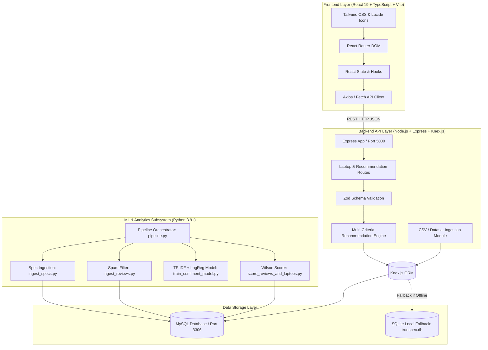
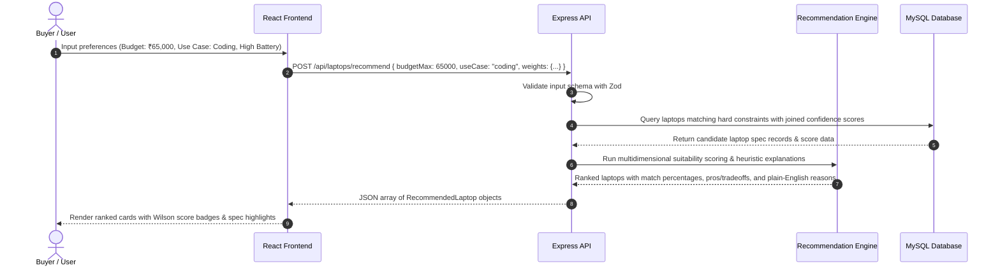
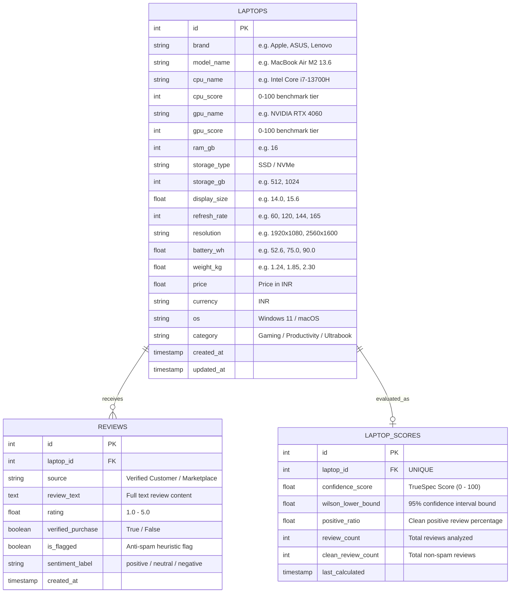
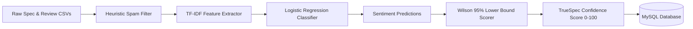

# TrueSpec — Data-Driven Hardware & Sentiment Intelligence Platform

> **An end-to-end, full-stack recommendation engine and sentiment analysis system that translates raw hardware benchmarks and verified customer feedback into objective, plain-English buying decisions.**

---

## Table of Contents

- [Problem Statement](#problem-statement)
- [Key Features](#key-features)
  - [User Features](#user-features)
  - [AI / ML & NLP Features](#aiml--nlp-features)
  - [Analytics & Diagnostic Features](#analytics--diagnostic-features)
  - [Data Integrity & Security Features](#data-integrity--security-features)
- [System Architecture](#system-architecture)
- [Application Workflow](#application-workflow)
- [Tech Stack](#tech-stack)
- [Database Design](#database-design)
- [API Documentation](#api-documentation)
- [Machine Learning & NLP Pipeline](#machine-learning--nlp-pipeline)
  - [1. Data Extraction & Heuristic Anti-Spam Filtering](#1-data-extraction--heuristic-anti-spam-filtering)
  - [2. Aspect-Based Sentiment Classification](#2-aspect-based-sentiment-classification)
  - [3. Wilson Lower Bound Confidence Scoring](#3-wilson-lower-bound-confidence-scoring)
  - [4. Multi-Dimensional Constraint Matching Engine](#4-multi-dimensional-constraint-matching-engine)
- [Project Directory Structure](#project-directory-structure)
- [Installation Guide](#installation-guide)
  - [Prerequisites](#prerequisites)
  - [1. Clone Repository](#1-clone-repository)
  - [2. Environment Configuration](#2-environment-configuration)
  - [3. Backend Setup](#3-backend-setup)
  - [4. Frontend Setup](#4-frontend-setup)
  - [5. Machine Learning Pipeline Execution (Optional)](#5-machine-learning-pipeline-execution-optional)
- [Environment Variables](#environment-variables)
- [Performance Considerations](#performance-considerations)
- [Engineering Challenges Solved](#engineering-challenges-solved)
- [Future Improvements](#future-improvements)

---

## Problem Statement

### The Real-World Problem
Modern consumer electronics marketplaces (Amazon, Flipkart, BestBuy) are flooded with conflicting marketing jargon, uncalibrated user ratings, and incentivized/spam reviews. 

1. **Jargon Overload**: Everyday buyers struggle to compare abstract spec sheets (e.g., *Intel Core i5-13420H vs. Ryzen 7 7730U* or *TGP 45W vs. 115W*).
2. **Review Inflation & Astroturfing**: Products often boast a 4.6/5.0 star rating based on promotional or duplicate bot reviews, hiding critical hardware flaws like thermal throttling, display backlight bleed, or rapid battery degradation.
3. **Small-Sample Bias**: A laptop with one 5-star review often ranks artificially higher than a battle-tested model with 500 reviews and a 4.3-star average.

### How TrueSpec Solves This
TrueSpec combines **deterministic hardware normalization**, **6-vector anti-spam heuristic filters**, **TF-IDF + Logistic Regression NLP sentiment scoring**, and **Wilson Score 95% Confidence Intervals** to produce an uncompromised **TrueSpec Confidence Score (0–100)** and tailored multi-criteria recommendations.

---

## Key Features

### User Features
- **Interactive Multi-Criteria Recommendation Engine**:
  - Interactive questionnaire filtering by use case (*Everyday, Student, Coding/Engineering, Creative/Design, Gaming, Business, Travel*).
  - Fine-grained priority weighting (Performance, Battery Life, Portability, Display Quality, Sentiment Confidence, and Value for Money).
  - Real-time constraint filters (Budget slider in INR ₹, OS selection, brand preferences, screen dimensions).
- **Comprehensive Hardware Catalog & Search**:
  - High-performance catalog browsing with instant multi-facet filtering (Brand, Category, OS, Price range, CPU/GPU tiers).
  - Dual view modes: High-density Spec Grid and Analytical Comparison Table.
- **Side-by-Side Laptop Comparison Tray**:
  - Multi-selection tray (compare up to 4 laptops simultaneously).
  - Side-by-side spec differential matrix highlighting CPU/GPU benchmarks, battery watt-hours, and review sentiment ratios.
- **Deep-Dive Hardware & Sentiment Detail Pages**:
  - Wilson confidence score breakdowns and sentiment distribution charts (Positive / Neutral / Negative).
  - Plain-English hardware summaries translating benchmarks into real-world workloads.
  - Authentic customer review feed with spam-filtered verification flags and aspect sentiment badges.
- **Interactive Methodology Explorer**:
  - Transparent documentation page detailing the mathematical formulas, Wilson lower-bound equations, and NLP architectures used.

### AI / ML & NLP Features
- **Aspect-Level Sentiment Analysis**:
  - TF-IDF unigram/bigram feature extraction trained on labeled aspect reviews (`Laptop_Train_v2.csv`).
  - Sentiment classification predicting user perception across thermal performance, battery life, screen quality, and build integrity.
- **Wilson Lower Bound 95% Confidence Engine**:
  - Statistical confidence interval calculation penalizing low-sample review sets while preserving statistically sound positive feedback.
- **Heuristic Fake Review Shield**:
  - 6-vector text and metadata verification filter flagging spam, short-length spam, duplicate bot submissions, promotional URLs, and excessive capitalization/punctuation.

### Analytics & Diagnostic Features
- **System Overview & Health Metrics**:
  - Summary metrics endpoint (`/api/stats/overview`) surfacing verified laptop count, total processed reviews, flagged spam ratio, and category distributions.
- **Interactive Data Re-synchronization**:
  - Instant re-seeding and pipeline trigger endpoints (`POST /api/laptops/reseed` and `POST /api/pipeline/run`).

### Data Integrity & Security Features
- **Strict Input Validation**:
  - All incoming API query parameters and recommendation payloads validated using **Zod** schemas.
- **SQL Injection Prevention**:
  - Parameterized queries and schema management via **Knex.js** query builder.
- **Graceful Multi-Database Failover**:
  - Production-ready support for **MySQL** with automatic fallback to **SQLite** (`better-sqlite3`) for zero-configuration local development.

---

## System Architecture



---

## Application Workflow



---

## Tech Stack

| Layer | Technology | Purpose |
| :--- | :--- | :--- |
| **Frontend Framework** | React 19 (TypeScript) | Declarative component UI with strict type safety |
| **Build Tooling** | Vite 6 | High-speed ESM bundling and local development |
| **Styling & Icons** | Tailwind CSS 4, Lucide React | Modern utility-first styling and iconography |
| **Routing** | React Router DOM v7 | Client-side page navigation and URL query synchronization |
| **Backend Runtime** | Node.js (ESM / TypeScript) | Scalable asynchronous I/O backend server |
| **Web Framework** | Express 4 | RESTful API endpoint routing and middleware execution |
| **Schema Validation** | Zod | Runtime request parameter and body schema validation |
| **Database ORM/Query** | Knex.js | SQL query builder, automated migration, and dialect abstraction |
| **Primary Database** | MySQL 8.0+ | Relational data persistence for laptops, reviews, and scores |
| **Fallback Database** | SQLite 3 (`better-sqlite3`) | Offline zero-config database fallback for isolated execution |
| **ML & Data Pipeline** | Python 3.9+, Pandas, NumPy | Data extraction, cleaning, and matrix computation |
| **NLP & Machine Learning** | Scikit-Learn (TF-IDF + Logistic Regression) | Aspect-based sentiment classification on customer reviews |
| **Statistical Modeling** | Wilson Score Interval (95% CI) | Binomial proportion confidence calculation on positive feedback |

---

## Database Design



---

## API Documentation

### Base URL
`http://localhost:5000/api`

### Endpoints

| Method | Endpoint | Description | Request Parameters / Body |
| :--- | :--- | :--- | :--- |
| `GET` | `/laptops` | Retrieve paginated list of laptops with optional search, sorting, and spec filters | `?page=1&limit=12&search=macbook&brand=Apple&minPrice=50000&maxPrice=100000&sortBy=confidence&sortDir=desc` |
| `GET` | `/laptops/:id` | Retrieve comprehensive hardware specs, Wilson confidence score, and verified reviews for a specific laptop | Path parameter: `id` (integer) |
| `POST` | `/laptops/recommend` | Run the multi-criteria suitability engine across the laptop catalog | JSON Body: `{ budgetMin: 40000, budgetMax: 80000, useCase: "coding", priorityWeights: { performance: 4, batteryLife: 5 } }` |
| `GET` | `/laptops/compare` | Fetch multiple laptops by ID list with side-by-side comparison metrics and sentiment distributions | `?ids=1,3,7` |
| `POST` | `/laptops/reseed` | Clean-reset database tables and ingest verified hardware datasets with Wilson confidence ratings | None |
| `GET` | `/stats/overview` | Fetch platform-wide statistics (catalog size, review volume, spam ratios) | None |
| `POST` | `/pipeline/run` | Trigger the offline Python ML/NLP pipeline to re-train sentiment model and recalculate scores | None |

---

## Machine Learning & NLP Pipeline



### 1. Data Extraction & Heuristic Anti-Spam Filtering
The module `ml/ingest_reviews.py` enforces 6 deterministic heuristics to protect against review manipulation:
- **Short-Length Spam**: Flagging reviews under 20 words lacking substantial evaluative context.
- **Duplicate Text Detection**: Identifying identical review bodies across multiple models.
- **Promotional URL Detection**: Flagging reviews containing affiliate or promotional domains (`bit.ly`, `discount`, `deal`).
- **Excessive Capitalization**: Flagging reviews where uppercase characters exceed 50% of the body.
- **Excessive Punctuation**: Flagging repeat character patterns (`!!!`, `???`).
- **Verified Purchase Requirement**: Prioritizing verified buyers for sentiment weight calculations.

### 2. Aspect-Based Sentiment Classification
- **Dataset**: Model trained on `Laptop_Train_v2.csv` containing annotated aspect sentences.
- **Feature Extraction**: Scikit-Learn `TfidfVectorizer` (unigrams + bigrams, sublinear TF scaling, max 10,000 features).
- **Classification Model**: Multi-class `LogisticRegression` optimized with balanced class weighting.

### 3. Wilson Lower Bound Confidence Scoring
To eliminate small-sample bias, the confidence engine calculates the 95% Wilson Score Interval lower bound:

$$\hat{p} = \frac{n_{\text{pos}}}{n}, \quad W = \frac{\hat{p} + \frac{z^2}{2n} - z \sqrt{\frac{\hat{p}(1 - \hat{p}) + \frac{z^2}{4n}}{n}}}{1 + \frac{z^2}{n}}$$

Where:
- $n$ = Count of verified non-spam reviews
- $n_{\text{pos}}$ = Count of verified clean reviews with positive sentiment
- $z = 1.96$ (corresponding to a 95% statistical confidence level)

The final **TrueSpec Score** integrates this statistical bound with a volume damping curve and a cleanliness penalty:
$$\text{TrueSpec Score} = \min\left(100, W \times 100 \times \text{VolumeFactor} \times \text{CleanlinessPenalty}\right)$$

### 4. Multi-Dimensional Constraint Matching Engine
Located in `backend/src/services/recommendationEngine.ts`:
- **Hardware Performance Index**: $(0.55 \times \text{CPU Score}) + (0.45 \times \text{GPU Score})$
- **Battery Endurance Index**: Normalized against a 100 Watt-hour baseline.
- **Portability Index**: Inverse weight curve ($1.0\text{ kg} \rightarrow 100$, $3.0\text{ kg} \rightarrow 30$).
- **Display Index**: Resolution pixel density and refresh rate ($60\text{ Hz} \rightarrow 165\text{ Hz}$).
- **Value for Money Index**: Normalized spec performance per ₹1,000.

---

## Project Directory Structure

```text
truespec/
├── backend/                        # Node.js + Express + Knex Backend Service
│   ├── knexfile.ts                 # Knex database configuration (MySQL & SQLite)
│   ├── package.json                # Backend dependencies & scripts
│   ├── tsconfig.json               # Backend TypeScript configuration
│   └── src/
│       ├── app.ts                  # Express application configuration & middleware
│       ├── server.ts               # Server startup & port binding
│       ├── db.ts                   # Database connection pool & auto-healing schemas
│       ├── migrations/             # Knex schema migration scripts
│       ├── routes/
│       │   └── laptopRoutes.ts     # REST API controllers & Zod validation
│       ├── seeds/
│       │   ├── csvSeeder.ts        # Direct CSV dataset ingestion engine
│       │   ├── defaultData.ts      # Structured verified laptop baseline dataset
│       │   └── seed.ts             # CLI seeding script
│       └── services/
│           └── recommendationEngine.ts # Multidimensional constraint matching engine
├── frontend/                       # React 19 + TypeScript + Vite Web Application
│   ├── index.html                  # HTML entry point
│   ├── package.json                # Frontend dependencies & scripts
│   ├── vite.config.ts              # Vite configuration & proxy definitions
│   └── src/
│       ├── App.tsx                 # Main layout & route tree configuration
│       ├── main.tsx                # React DOM root entry
│       ├── types.ts                # Shared TypeScript interfaces & types
│       ├── components/
│       │   ├── CompareTray.tsx     # Floating multi-item comparison tray
│       │   ├── ConfidenceBadge.tsx # Visual Wilson confidence score badge
│       │   ├── Footer.tsx          # Global site footer
│       │   ├── LaptopCard.tsx      # Standardized laptop card with spec highlights
│       │   └── Navbar.tsx          # Global navigation header
│       └── pages/
│           ├── BrowsePage.tsx      # Paginated catalog with multi-facet filters
│           ├── ComparePage.tsx     # Side-by-side spec comparison matrix
│           ├── HomePage.tsx        # Hero landing with quick use-case selectors
│           ├── LaptopDetailPage.tsx# Comprehensive specs & sentiment breakdown
│           ├── MethodologyPage.tsx # Transparent documentation of math & formulas
│           └── RecommendPage.tsx   # Interactive questionnaire & custom recommendations
├── data/                           # Data repository
│   ├── generate_datasets.py        # Dataset synthesis and test generation script
│   └── raw/
│       ├── laptops_cleaned.csv     # Cleaned hardware specification dataset
│       ├── laptops_dataset_final_600.csv # 600 verified customer reviews
│       └── Laptop_Train_v2.csv     # Aspect sentiment NLP training dataset
├── ml/                             # Python Machine Learning & NLP Subsystem
│   ├── requirements.txt            # Python ML dependencies (scikit-learn, pandas)
│   ├── db.py                       # SQLAlchemy database connector (MySQL / SQLite)
│   ├── ingest_specs.py             # Spec ingestion script
│   ├── ingest_reviews.py           # Review ingestion and heuristic spam filter
│   ├── train_sentiment_model.py    # TF-IDF + Logistic Regression training
│   ├── score_reviews_and_laptops.py# Wilson confidence scorer & score updater
│   └── pipeline.py                 # Full 4-step pipeline orchestration script
├── .env.example                    # Environment variable template
├── package.json                    # Monorepo root scripts & dev orchestration
└── README.md                       # Complete project documentation
```

---

## Installation Guide

### Prerequisites
- **Node.js**: `v18.0.0` or higher (`v20+` recommended)
- **npm**: `v9.0.0` or higher
- **MySQL**: `v8.0` or higher (Optional — system auto-falls back to SQLite if MySQL is not running)
- **Python**: `3.9+` (Optional — only required to re-train ML models)

---

### 1. Clone Repository
```bash
git clone https://github.com/your-username/truespec.git
cd truespec
```

---

### 2. Environment Configuration
Create a `.env` file in the root or `backend/` directory based on `.env.example`:

```env
PORT=5000
DB_TYPE=mysql
DB_HOST=localhost
DB_PORT=3306
DB_USER=root
DB_PASSWORD=
DB_NAME=truespec_db
```

*If using MySQL, create the database once in MySQL CLI / Workbench:*
```sql
CREATE DATABASE IF NOT EXISTS truespec_db;
```

---

### 3. Backend Setup
1. Navigate to the `backend` folder and install dependencies:
   ```bash
   cd backend
   npm install
   ```

2. Seed the database directly from the provided datasets:
   ```bash
   npx tsx src/seeds/seed.ts
   ```

3. Start the backend development server:
   ```bash
   npm run dev
   ```
   *The backend will boot on `http://localhost:5000`.*

---

### 4. Frontend Setup
1. Open a new terminal, navigate to the `frontend` folder, and install dependencies:
   ```bash
   cd frontend
   npm install
   ```

2. Start the Vite development server:
   ```bash
   npm run dev
   ```

3. Open your browser and navigate to:
   ```
   http://localhost:5173
   ```

---

### 5. Machine Learning Pipeline Execution (Optional)
To re-run the Python ML training and sentiment scoring pipeline:

```bash
cd ml
pip install -r requirements.txt
python pipeline.py
```

---

## Environment Variables

| Variable | Type | Default | Description |
| :--- | :--- | :--- | :--- |
| `PORT` | `number` | `5000` | HTTP port for the Express backend server |
| `DB_TYPE` | `string` | `mysql` | Database driver (`mysql` or `sqlite`) |
| `DB_HOST` | `string` | `localhost` | MySQL host address |
| `DB_PORT` | `number` | `3306` | MySQL port |
| `DB_USER` | `string` | `root` | MySQL database user |
| `DB_PASSWORD` | `string` | `""` | MySQL database password |
| `DB_NAME` | `string` | `truespec_db` | MySQL database schema name |
| `VITE_API_URL` | `string` | `/api` | Base API URL proxy used by the frontend |

---

## Performance Considerations

1. **Auto-Healing Schema Migration**: `backend/src/db.ts` programmatically detects and alters missing table columns on boot without requiring manual SQL migrations.
2. **Paginated Query Execution**: Catalog queries utilize indexed `LIMIT` and `OFFSET` clauses with windowed page controls to prevent excessive memory overhead.
3. **Precomputed Wilson Confidence Indices**: Sentiment ratios and Wilson lower bounds are precomputed and stored in `laptop_scores`, allowing instant $O(1)$ reads during catalog browsing and recommendation ranking.
4. **Optimized Client State**: Comparison trays and user filters are managed in client state, avoiding redundant network roundtrips until final comparison matrices are requested.

---

## Engineering Challenges Solved

- **Combating Review Astroturfing**: Formulated a 6-vector heuristic spam filter combined with Wilson score intervals to prevent inflated 5-star ratings from dominating recommendations.
- **Handling Schema Drift across SQL Dialects**: Built a dual-dialect ORM layer via Knex that supports MySQL in production and seamless local SQLite fallbacks for isolated testing.
- **Translating Hardware Jargon to Actionable Insights**: Engineered a rule-based constraint matching engine that pairs quantitative benchmark normalization with deterministic plain-English explanations.

---

## Future Improvements

- [ ] **Dynamic Web Scraping Agents**: Periodic background workers to ingest live customer reviews from e-commerce platforms.
- [ ] **Transformer-based Embeddings**: Upgrading TF-IDF aspect extraction to lightweight RoBERTa or MiniLM embeddings for deeper context comprehension.
- [ ] **Price History & Drop Alerts**: Historical price tracking charts to indicate historical price fluctuations in INR.
- [ ] **Multi-Category Expansion**: Extending the TrueSpec scoring framework to PC components, smartphones, and tablets.

---

<div align="center">
  <sub>Built with precision using React, TypeScript, Express, Knex, MySQL, and Scikit-Learn.</sub>
</div>
